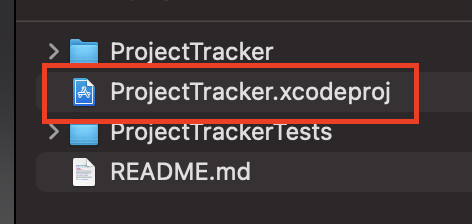
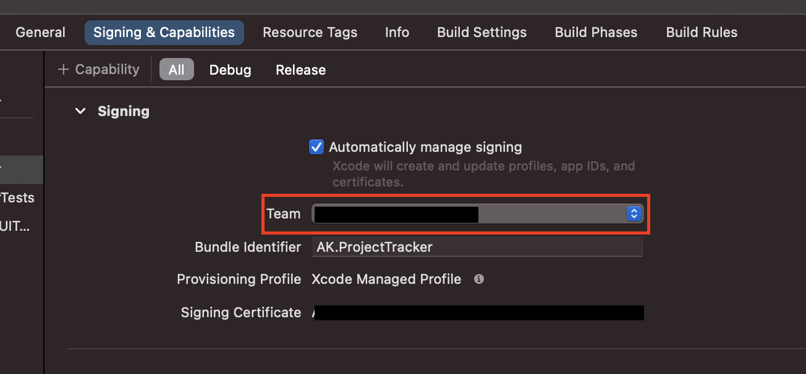
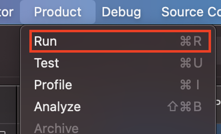
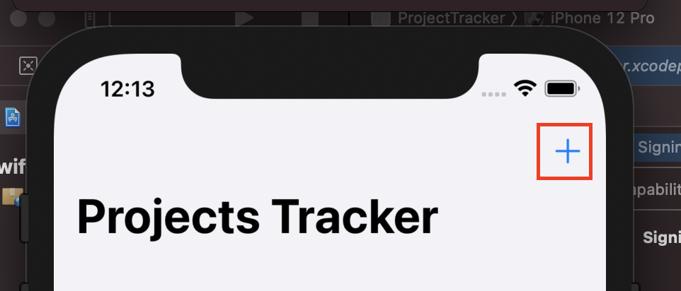
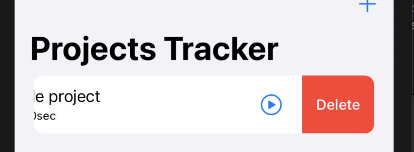

# Projects Tracker

## How to run the project

1. After cloning the repository to a directory of your choice, open the ***ProjectTracker.xcodeproj*** file with Xcode 12.
   
    

2. Select correct ***Team*** in ***Signing & Capabilities*** section.

    

3. Run the project with ***cmd+r*** or ***Product -> Run***.

    

4. When the application starts, click "***+***" button to add your first project.

    

5. You can delete projects by swiping cells to the left.

    